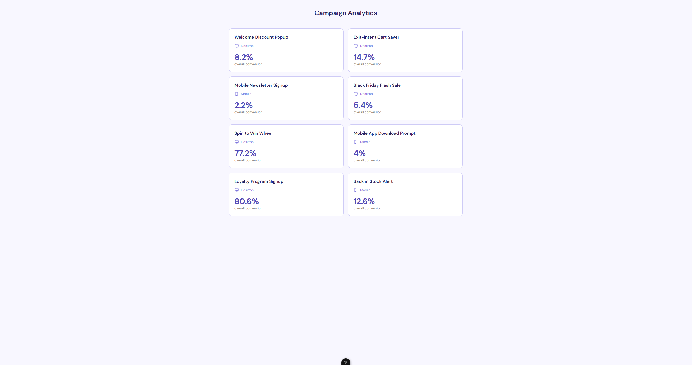
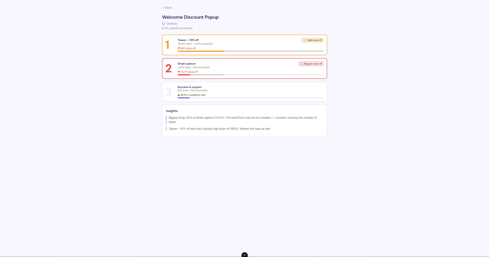
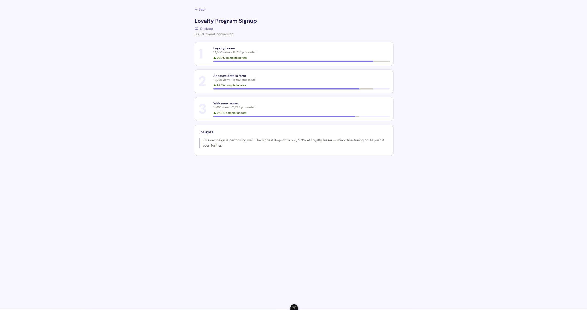
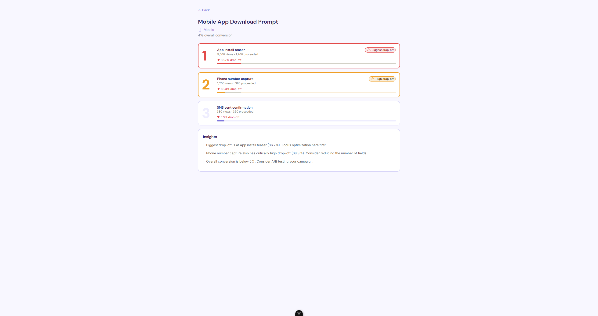
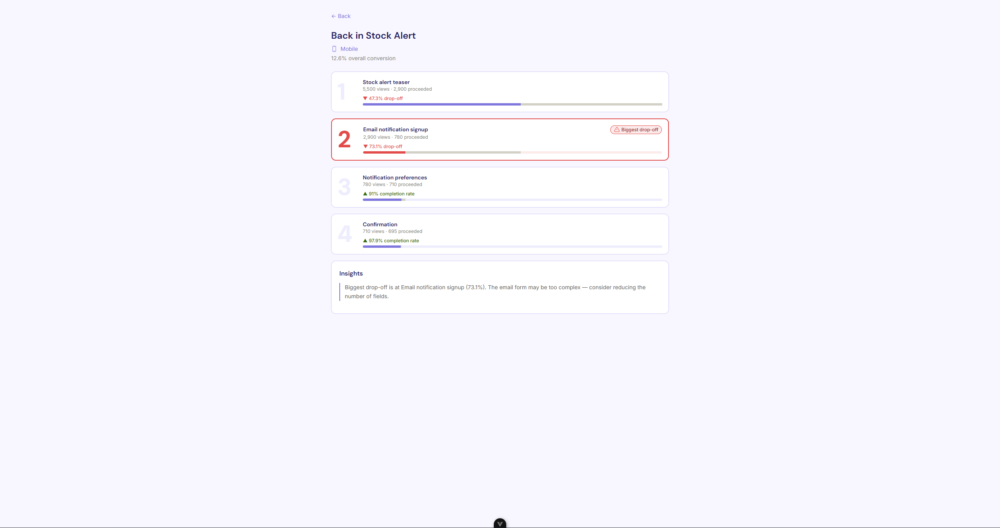

# Funnel Analytics

A small funnel analytics web app for popup campaigns. Marketers can see step-by-step drop-off data for each campaign and quickly identify the worst-performing steps.

## Screenshots


*Campaign list — 8 campaigns with overall conversion rates and device indicators*


*Step-level funnel — biggest drop-off (red) and critically high drop-off (orange) highlighted simultaneously*


*Positive insights panel when all steps perform within acceptable thresholds*


*First step identified as biggest drop-off with full 3-insight panel*


*4-step funnel with green completion rates without critical steps*

## Prerequisites

- Node.js `^20.19.0` or `>=22.12.0`

## Setup

```bash
npm install
```

## Run

```bash
npm run dev
```

Open [http://localhost:5173](http://localhost:5173) in your browser.

## Build

```bash
npm run build
```

## Project structure

```
src/
├── assets/
│   ├── fonts/          # DM Sans, Inter
│   └── icons/          # SVG icons (Heroicons)
├── components/
│   ├── CampaignCard.vue
│   ├── FunnelStep.vue
│   └── InsightsPanel.vue
├── composables/
│   ├── useCampaigns.ts
│   └── useFunnelMetrics.ts
├── data/
│   └── campaigns.json
├── types/
│   └── index.ts
└── views/
    ├── CampaignListView.vue
    └── CampaignDetailView.vue
```

See [WRITEUP.md](./WRITEUP.md) for design decisions, v1 scope, and AI usage.
